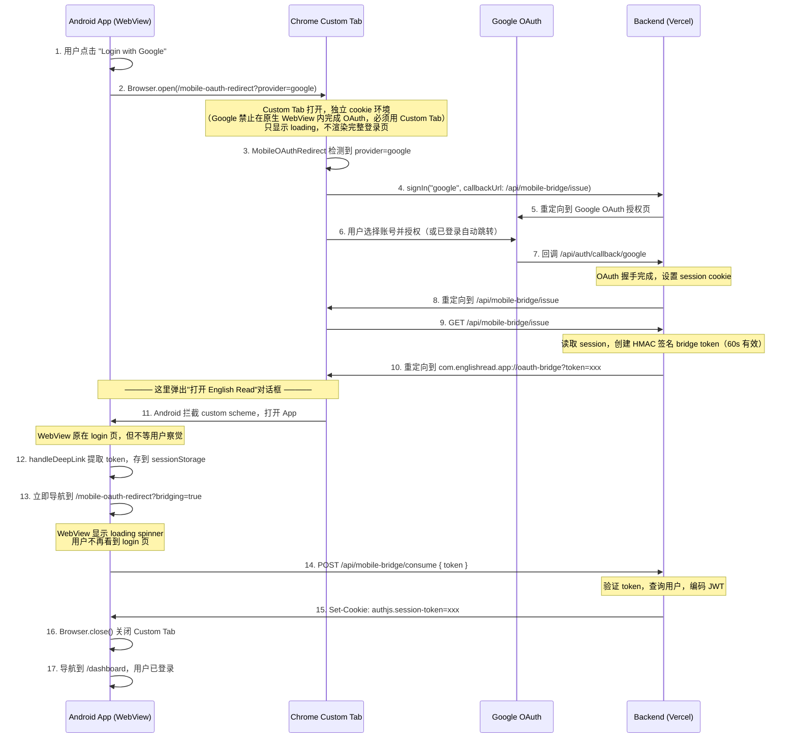
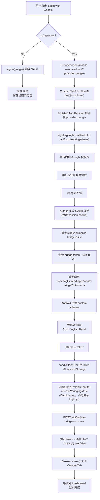

## 与 GitHub 流程的差异

Google 登录在 App 端与 GitHub 登录**完全共用同一套 Bridge 机制**（`useCapacitorOAuth` / `openOAuthUrl` / `MobileOAuthRedirect` / `/api/mobile-bridge/*`），唯一区别是 `signInWithOAuth("google")` 传入的 provider 不同。之所以必须走 Custom Tab + Bridge Token，而不能像手机号/邮箱那样在 WebView 内直连，是因为 **Google 明确禁止 OAuth 授权页在嵌入式 WebView（`WebView`/`Capacitor` 原生 WebView）中展示**，只允许系统级浏览器（Chrome Custom Tabs / SFSafariViewController）完成登录，随后再通过自定义 scheme 深链接把结果传回 App。
