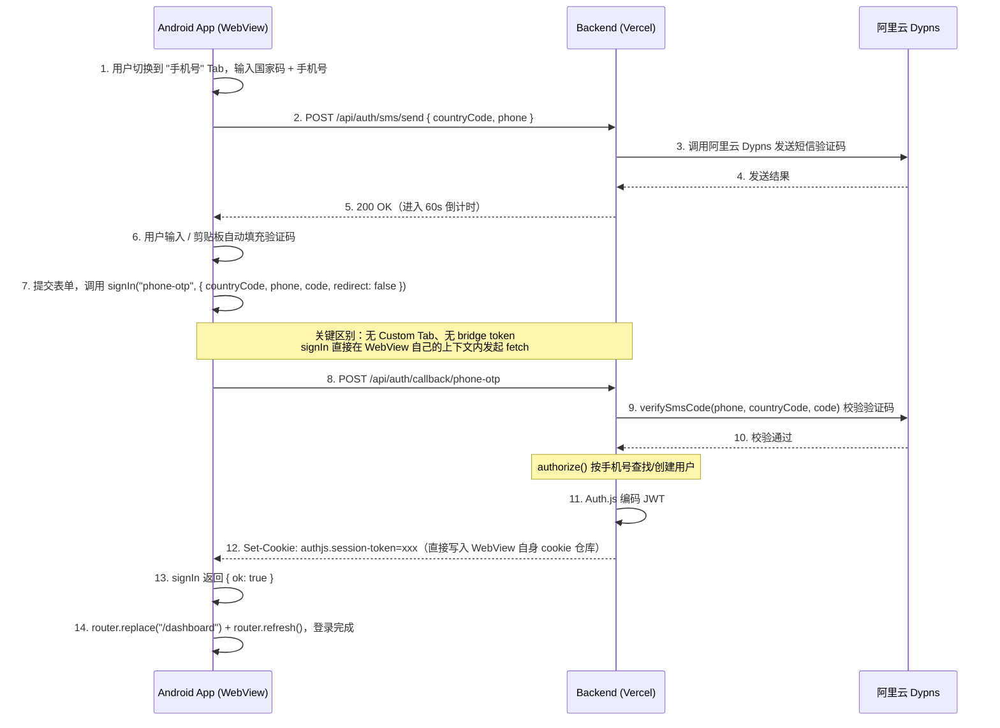
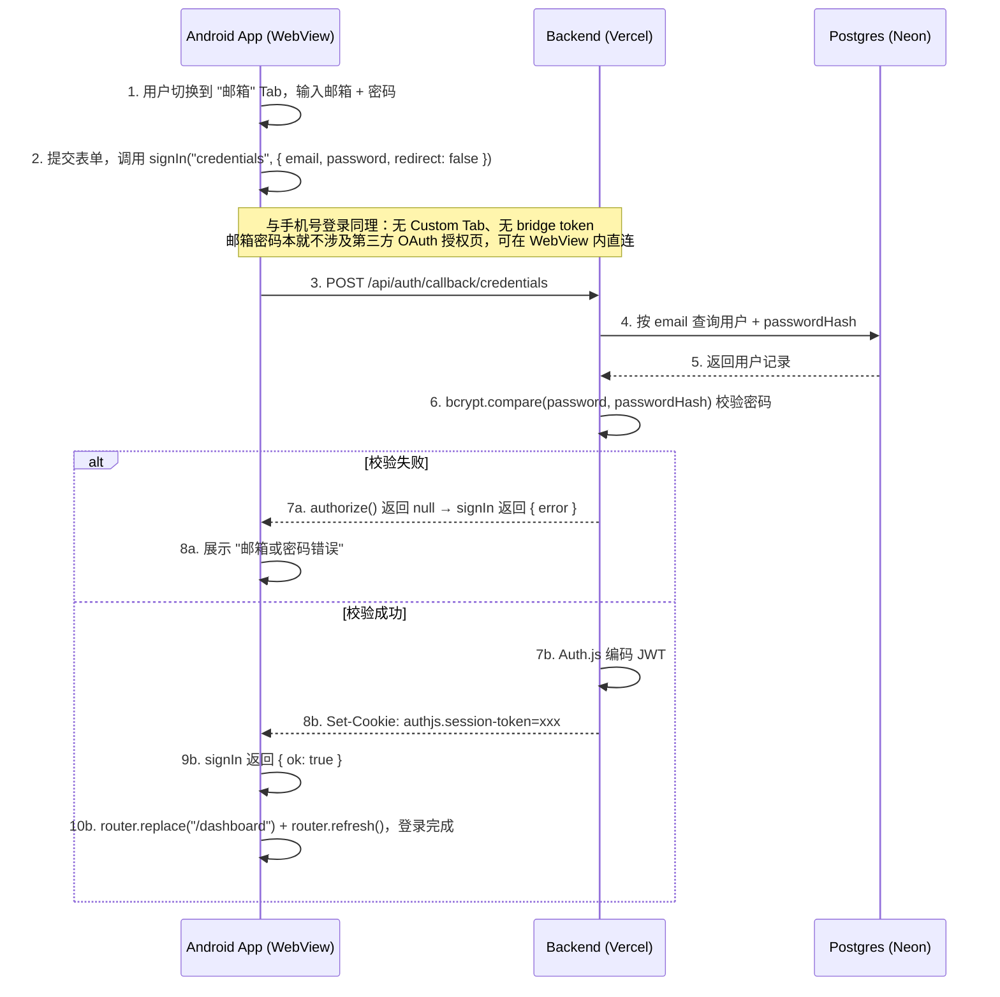
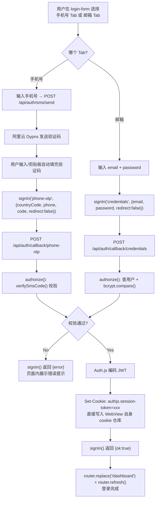

## 与 GitHub / Google 流程的差异

手机号验证码和邮箱密码登录都基于 NextAuth `Credentials` provider（分别是 `phone-otp` 和默认的 `credentials`），本质是**同源表单提交**，不涉及第三方 OAuth 授权页跳转，因此在 App 端**完全不需要 Custom Tab、不需要自定义 scheme 深链接、不需要 `/api/mobile-bridge/*` 桥接令牌**：

- `signIn(provider, { redirect: false })` 直接从当前 WebView 页面发起 fetch 请求到 `/api/auth/callback/{provider}`。
- 请求与响应都发生在 WebView 自己的上下文里，`Set-Cookie` 会自动写入 WebView 自身的 cookie 仓库。
- 无论是否在 Capacitor 原生壳内（`isCapacitor()`），这条路径的代码完全一致 —— `onPhoneSubmit` / `onCredentialsSubmit` 中没有任何 `isCapacitor()` 分支判断，因为不存在"必须切到系统浏览器"的强制要求（这一点与 Google 强制要求 Custom Tab 的场景相反，见 [android-google-login-flow.mermaid.md](./android-google-login-flow.mermaid.md)）。
- 手机号登录多了一步前置的短信发送/校验（`/api/auth/sms/send` + 阿里云 Dypns `verifySmsCode`），邮箱登录则是直接 `bcrypt.compare` 校验密码哈希，两者校验方式不同，但拿到结果后设置 session cookie 的收尾逻辑完全一致。
