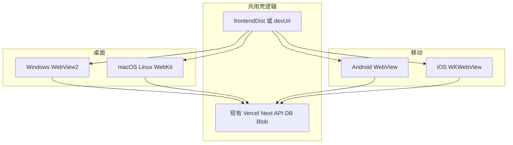

# Tauri 壳 + 后端 + Android/iOS：文档与命令计划（修订）

## 相对原计划的变更

- **目标重心**：除 Windows/macOS/Linux **桌面** 外，增加 **Android APK/AAB** 与 **iOS** 的生成与开发流程说明；文档中明确 **iOS 必须在 macOS + Xcode 上开发与签名**（无法在纯 Windows 上本地完成 iOS 包，只能 CI 或借 Mac）。
- **架构不变**：仍采用 `**build.frontendDist` 为生产环境 HTTPS**（或开发期 `devUrl` 指向本机 Next），**不**将 [next.config.mjs](next.config.mjs) 改为 `output: 'export'`；与 [官方 Next.js + Tauri 静态导出指南](https://v2.tauri.app/start/frontend/nextjs/) 的差异说明保留并写清「移动端同样走远程 WebView 壳」。

## 官方文档对齐（v2）

- [Prerequisites — Configure for Mobile Targets](https://v2.tauri.app/start/prerequisites/#configure-for-mobile-targets)：Android（Android Studio、`JAVA_HOME`、`ANDROID_HOME`、`NDK_HOME`、SDK 组件、`rustup target add` 四条 Android triple）；iOS（仅 macOS、完整 Xcode、`rustup target add` iOS triples、Homebrew + CocoaPods）。
- [Create a Project / Manual Setup](https://v2.tauri.app/start/create-project/)：`npm install -D @tauri-apps/cli@latest`、`npx tauri init`。
- [Project Structure](https://v2.tauri.app/start/project-structure/)：`src-tauri`、移动子项目生成目录（`gen/android`、`gen/ios` 等在 init 后出现，文档说明勿随意手改生成物）。
- [Distribute — Google Play / App Store](https://v2.tauri.app/distribute/)：上架与签名为文档「延伸阅读」，本期 `**buil`**以 **能 `androidd` / `ios build` 出包** 为主。
- Windows 桌面前置仍见 [Prerequisites — Windows](https://v2.tauri.app/start/prerequisites/#windows)（C++ Build Tools、WebView2、Rust MSVC）。

## 文档结构（建议仍用 [docs/tauri-shell.md](docs/tauri-shell.md) 或拆为 `docs/tauri-mobile.md` 链回主文档）

1. **概述**：三端（Win/mac/Linux）+ Android + iOS；业务仍在云端。
2. **桌面段**（保持原计划）：Manual Setup、`devUrl`、`beforeDevCommand`、`frontendDist` 远程 URL、`tauri dev` / `tauri build`、capabilities / remote、OAuth 备注。
3. **新增 — Android 专章**
  - 前置：按官方列表安装 Android Studio、配置 `JAVA_HOME`、`ANDROID_HOME`、`NDK_HOME`；`rustup target add aarch64-linux-android armv7-linux-androideabi i686-linux-linux-android x86_64-linux-android`（以 [Prerequisites](https://v2.tauri.app/start/prerequisites/#android) 为准）。
  - 初始化（首次）：`npx tauri android init`（文档注明需在已 `tauri init` 的仓库内执行；版本以 CLI 为准）。
  - 开发：`npx tauri android dev`（真机可加官方文档中的 `--host` 等说明）。
  - 构建：`npx tauri android build`。
  - **远程 URL**：说明 Release 包内 WebView 默认加载的仍是 `tauri.conf.json` 中配置的 URL；内网调试可把 `devUrl` 或允许的主机写入文档注意事项（含 cleartext/局域网 HTTPS 等风险，仅作「可选进阶」一句）。
4. **新增 — iOS 专章**
  - **硬约束**：仅 macOS；安装 **完整 Xcode**（非仅 Command Line Tools）；Apple 开发者账号与签名/Capabilities 为后续上架必备。
  - `rustup target add aarch64-apple-ios x86_64-apple-ios aarch64-apple-ios-sim`（以官方为准）；`brew install cocoapods`。
  - 初始化：`npx tauri ios init`；开发：`npx tauri ios dev`；构建：`npx tauri ios build`。
  - Windows 用户路径：用 **远程 Mac CI**（如 GitHub Actions macos-latest）或实体 Mac；文档中单独一小节说明。
5. **命令总表（写入文档）**

| 场景             | 命令                        |
| -------------- | ------------------------- |
| 仅 Next 浏览器     | `npm run dev`             |
| 桌面壳开发          | `npx tauri dev`           |
| 桌面壳生产包         | `npx tauri build`         |
| Android 开发     | `npx tauri android dev`   |
| Android 生产包    | `npx tauri android build` |
| iOS 开发（仅 Mac）  | `npx tauri ios dev`       |
| iOS 生产包（仅 Mac） | `npx tauri ios build`     |
| 环境诊断           | `npx tauri info`          |

1. **验收标准（修订）**
  - 文档覆盖：桌面 + Android + iOS 的前置、init、dev、build 与平台限制。
  - 实现阶段（用户确认后）：仓库内 `tauri init` 后按需执行 `android init` / `ios init`；`package.json` 可增加便捷 scripts（如 `tauri:android:dev`）。

## 仍不做的范围（避免范围爆炸）

- 不替代应用商店审核、隐私政策、ICP 等合规文案。
- 不在本期计划内实现「系统浏览器 OAuth + Deep Link」完整方案，仅保留文档级备注。

## 与旧计划文件的关系

原 [tauri_壳文档与命令_31bbb10e.plan.md](c:\Users\fengyubiao.cursor\plans\tauri_壳文档与命令_31bbb10e.plan.md) 由本修订版取代；实施时以本文档为准。