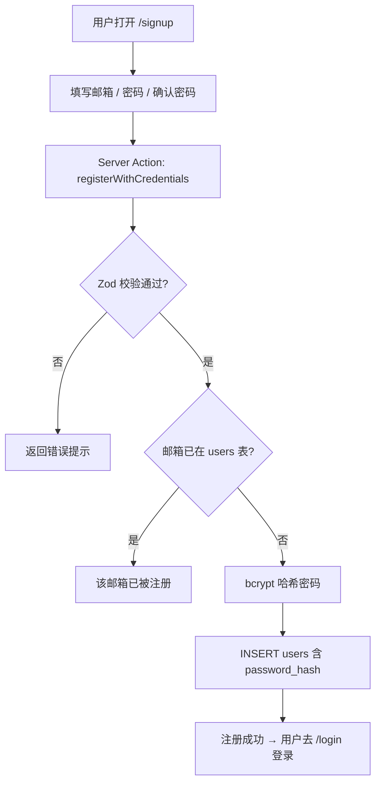
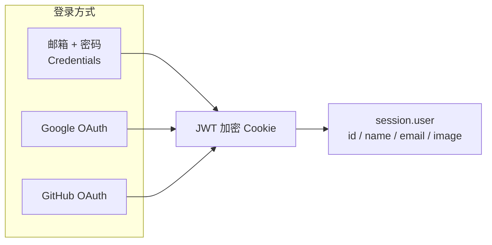
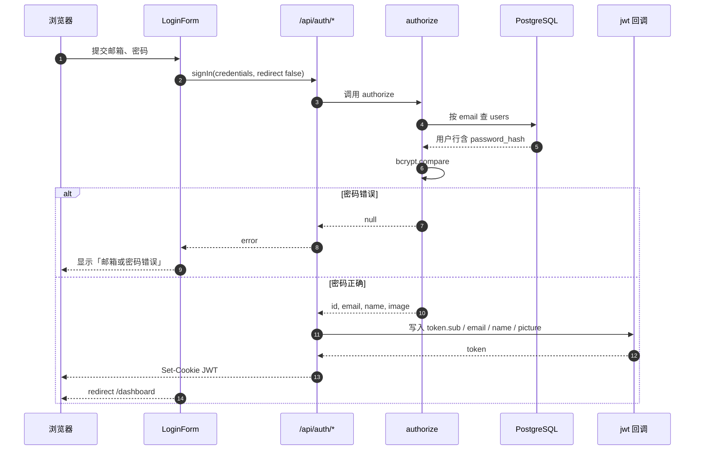
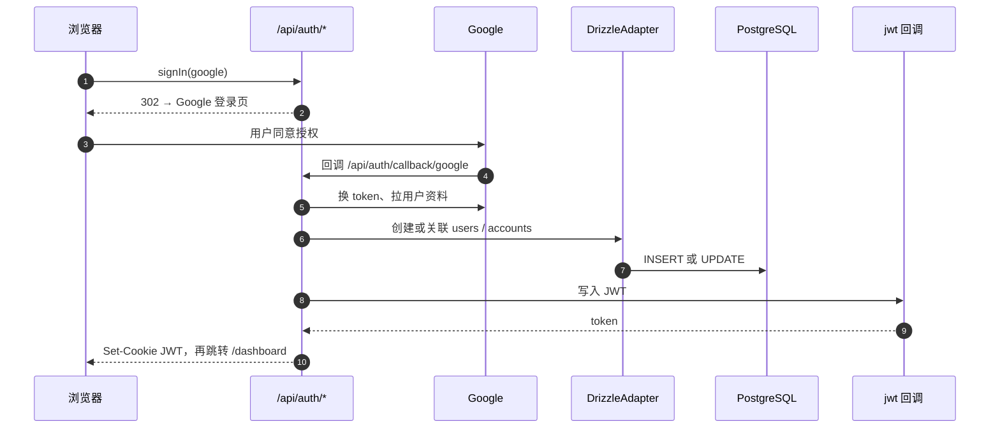
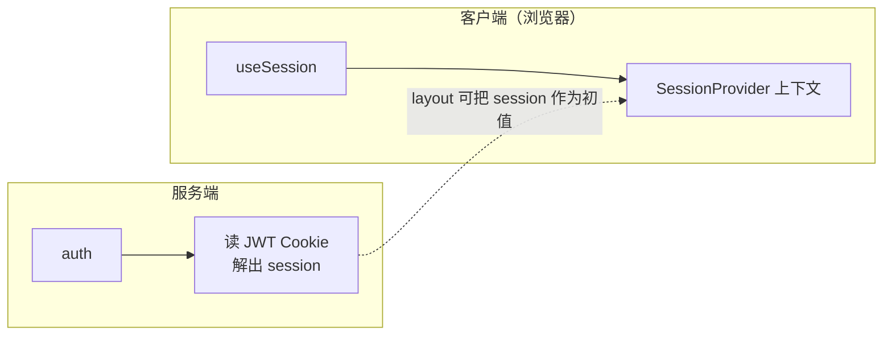

# 认证与用户流程说明

本文档说明本项目中用户从**注册**到**登录**、**会话中的用户信息**如何产生，以及**页面与 API 如何校验登录状态**。实现基于 **NextAuth.js v5（Auth.js）**、**JWT 会话策略**、**Drizzle + PostgreSQL**。

---

## 0. 流程图与泳道图（推荐先看）

下面用 **Mermaid** 画图。若在 GitHub / VS Code 预览中无法渲染，可安装 Mermaid 插件或将代码贴到 [mermaid.live](https://mermaid.live) 查看。

### 0.1 注册（仅邮箱密码）




### 0.2 三种登录如何「汇合」到同一会话

无论哪种方式，成功后都会在浏览器里落下 **同一个 JWT 会话 Cookie**，后续 `auth()` / `useSession()` 读的都是它。




### 0.3 邮箱密码登录（时序图）




### 0.4 Google 登录（时序图）

**GitHub** 与下图结构相同，仅授权页与回调路径为 `/api/auth/callback/github`，Adapter 写入 `provider: github`。




### 0.5 登录后访问资源：谁在「校验登录」（泳道式总览）

「泳道」按**角色**划分：页面请求走 **middleware**；**API 不走 middleware**，由各自 Route 调 `auth()`。

```mermaid
flowchart TB
  subgraph B["浏览器"]
    B1[带 JWT Cookie 的请求]
  end

  subgraph M["middleware.ts（仅页面路由）"]
    M1{路径是 /dashboard 等<br/>受保护前缀?}
    M2[req.auth 有值?]
    M3[302 → /login]
    M4[放行页面渲染]
  end

  subgraph P["页面 / Server Component"]
    P1[layout: await auth()]
    P2[SessionProvider 注入 session]
  end

  subgraph API["/api/*（matcher 排除，不经 middleware）"]
    A1[Route Handler]
    A2[await auth()]
    A3{session?.user?.id?}
    A4[401]
    A5[业务逻辑]
  end

  B1 --> M1
  M1 -->|是| M2
  M2 -->|否| M3
  M2 -->|是| M4
  M4 --> P1
  P1 --> P2

  B1 -.->|并行：fetch /api/...| A1
  A1 --> A2
  A2 --> A3
  A3 -->|否| A4
  A3 -->|是| A5
```


### 0.6 客户端与服务端如何读到「当前用户」




---

## 1. 核心概念一览


| 项目       | 说明                                                                                                                                        |
| -------- | ----------------------------------------------------------------------------------------------------------------------------------------- |
| 会话策略     | **JWT**（加密会话 Cookie，非「数据库 Session 表」作为主会话载体）                                                                                              |
| 认证入口     | `src/lib/auth.ts` 中 `NextAuth({ ... })` 导出 `handlers`、`auth`、`signIn`、`signOut`                                                           |
| HTTP 路由  | `src/app/api/auth/[...nextauth]/route.ts` 将 `GET`/`POST` 交给 `handlers`（如 `/api/auth/signin`、`/api/auth/callback/*`、`/api/auth/session` 等） |
| 数据库      | `users` 存用户资料；`accounts` 存 OAuth 提供商账号与本地 `users` 的关联；注册与 OAuth 会写入这些表                                                                    |
| 为何统一 JWT | 代码注释说明：若 Credentials 使用默认 `database` 会话，浏览器 Cookie 会被当作 DB 的 `sessionToken` 查询，导致 Credentials 登录永远无会话；因此**强制 JWT**，OAuth 与邮箱密码共用同一套会话逻辑   |


---

## 2. 数据模型（与登录相关的部分）

- `**users`**：`id`、`email`、`name`、`image`、`password_hash`（仅邮箱密码用户有值）、`time_zone` 等。
- `**accounts**`：OAuth 时存在一行（`provider` + `providerAccountId` 与 `user_id`），用于把 GitHub/Google 账号绑定到 `users.id`。
- `**sessions` 表**：由 Drizzle Adapter 维护；在 **JWT 策略**下，**日常请求不依赖**该表里的行来识别用户，主要会话信息在 **JWT Cookie** 中。

---

## 3. 注册流程（仅邮箱 + 密码）

注册**不经过** NextAuth 的 `signUp`，而是应用自己的 Server Action。

1. 用户访问 `/signup`，提交邮箱、密码、确认密码。
2. `src/app/(auth)/signup/actions.ts` 中 `registerWithCredentials`：
  - 使用 **Zod** 校验邮箱格式、密码长度（≥8）、两次密码一致；邮箱会 **转小写并 trim**。
  - 查询 `users` 是否已有该 `email`；若有则返回「该邮箱已被注册」。
  - 使用 **bcrypt**（cost 12）生成 `passwordHash`，`insert` 新用户（仅 `email` + `passwordHash` 等，无 OAuth `accounts` 行）。
3. 注册成功后用户需到 `**/login`** 使用同一邮箱密码登录（无「注册后自动登录」的独立流程，除非前端另有跳转逻辑）。

---

## 4. 登录方式总览


| 方式      | 入口 UI                    | NextAuth Provider | 用户数据来源                                    |
| ------- | ------------------------ | ----------------- | ----------------------------------------- |
| 邮箱 + 密码 | `LoginForm` 表单提交         | `Credentials`     | `authorize` 查库 + `bcrypt.compare`         |
| Google  | 按钮 `signIn("google", …)` | `Google`          | OAuth 回调后由 Adapter 写 `users` / `accounts` |
| GitHub  | 按钮 `signIn("github", …)` | `GitHub`          | 同上                                        |


配置见 `src/lib/auth.ts`：`allowDangerousEmailAccountLinking: true` 表示若 OAuth 返回的邮箱与已有用户相同，允许**按邮箱链接**到同一用户（需注意安全风险，生产环境应结合业务策略评估）。

---

## 5. 账号密码登录（详细流程）

### 5.1 前端

1. `src/components/login-form.tsx`：`signIn("credentials", { email, password, redirect: false })`。
2. `redirect: false` 时，根据返回的 `res.ok` / `res.error` 在页面显示「邮箱或密码错误」或 `router.replace("/dashboard")` + `router.refresh()`。

### 5.2 服务端（Credentials）

1. 请求进入 `/api/auth/callback/credentials`（由 Auth.js 内部处理）。
2. `authorize`（`src/lib/auth.ts`）：
  - 校验 `email`、`password` 为字符串；邮箱 **小写 + trim**。
  - 按 `email` 查询 `users`，必须存在且 `password_hash` 非空。
  - `bcrypt.compare(明文, password_hash)`，失败则返回 `null`（前端表现为登录失败）。
3. 成功时返回 `{ id, email, name, image }`，供后续写入 JWT。

### 5.3 会话（JWT）建立

1. `**jwt` 回调**在首次登录且存在 `user` 时：把 `user.id` → `token.sub`，`email`、`name`、`image` → `token` 的 `email`、`name`、`picture`（头像在 JWT 内用 `picture` 字段）。
2. Auth.js 将 `token` **加密**写入会话 Cookie（默认 JWE）。
3. 之后每次请求带上该 Cookie，解码得到 `token`，再通过 `**session` 回调**把 `token.sub` 赋给 `session.user.id`；`session.user` 的 `name` / `email` / `image` 由框架根据 `token` 组装（与默认行为一致）。

### 5.4 与「数据库 Session」的区别

Credentials 登录成功后**不会在「日常访问」里用 `sessions` 表查会话**；识别用户依赖 **JWT**。`users` 表用于校验密码与存储资料。

---

## 6. Google 登录（详细流程）

### 6.1 前端

- `signIn("google", { callbackUrl: "/dashboard" })`：浏览器跳转到 Google 授权页（具体 URL 由 Auth.js 生成）。

### 6.2 OAuth 与数据库

1. 用户同意授权后，Google 回调到 `**/api/auth/callback/google`**（由 `handlers` 处理）。
2. Auth.js 用授权码换取 token，拉取 Google 用户资料（含 `sub`、邮箱、姓名、头像等）。
3. **DrizzleAdapter**：
  - 若该 Google 账号（`provider` + `providerAccountId`）已存在 `accounts` 行，则关联到已有 `users.id`。
  - 若不存在，可能**创建新 `users` 行**并创建 `accounts` 行（具体分支由 Adapter 与 `allowDangerousEmailAccountLinking` 等策略决定）。
4. 与 Credentials 相同：最终仍走 `**jwt` 回调**，把当前用户写入 **JWT**，而非依赖数据库里的 `sessions` 行作为主会话。

### 6.3 环境变量

- `GOOGLE_CLIENT_ID`、`GOOGLE_CLIENT_SECRET`（及 Auth 所需的 `AUTH_SECRET`、`AUTH_URL` 等）。

---

## 7. GitHub 登录（详细流程）

与 Google 类似，区别仅在提供商与 OAuth 端点。

1. 前端：`signIn("github", { callbackUrl: "/dashboard" })`。
2. 回调路径形如 `**/api/auth/callback/github`**。
3. Adapter 在 `accounts` 中记录 `provider: "github"` 与 GitHub 用户 id；`users` 存展示名、邮箱、头像等（以 GitHub 返回为准）。
4. 会话同样落在 **JWT Cookie**；`jwt` / `session` 回调行为与上文一致。

### 环境变量

- `GITHUB_CLIENT_ID`、`GITHUB_CLIENT_SECRET`。

---

## 8. 登录后的用户信息：如何读取与更新

### 8.1 服务端（Server Components、Route Handlers、Server Actions）

- 使用 `**auth()`**（来自 `src/lib/auth.ts`）：例如根布局 `src/app/layout.tsx` 中 `const session = await auth()`，将 `session` 传给 `SessionProvider`。
- API 路由中常见写法：`const session = await auth(); if (!session?.user?.id) return 401`。

### 8.2 客户端（浏览器）

- 使用 `**useSession()**`（需在 `SessionProvider` 内）：`session.user.id`、`session.user.name`、`session.user.email`、`session.user.image`。
- 调用 `**useSession().update(数据)**` 会触发 `/api/auth/session` 的 **POST**，`jwt` 回调里 `trigger === "update"` 时从数据库刷新用户资料，并可合并客户端传入的字段（见 `src/lib/auth.ts` 中 `mergeClientSessionIntoJwt`）。

### 8.3 JWT 里装了什么（概念上）

- `sub`：用户 id（与 `users.id` 一致）。
- `email`、`name`、`picture`：用于拼出 `session.user`；`picture` 对应前端的 `image`。

---

## 9. 「登录校验」两层机制

### 9.1 中间件：页面级路由保护

- 文件：`middleware.ts`。
- 使用 `**auth()` 包装**（`export default auth((req) => { ... })`），根据 `req.auth` 是否为空判断「是否已登录」。
- **受保护路径**（前缀匹配）：`/dashboard`、`/library`、`/read`、`/vocabulary`、`/settings`。未登录访问 → **302 到 `/login`**。
- 已登录访问 `**/login` 或 `/signup**` → **302 到 `/dashboard`**。
- `**matcher**` 排除了 `api`、`_next/static`、`_next/image`、`favicon.ico` 等，因此 **中间件不拦截 `/api/*`**。

### 9.2 API 路由：各自调用 `auth()`

- 受保护的业务 API（如 `/api/books`、`/api/user/profile` 等）在处理器开头 `**await auth()**`，无 `session?.user?.id` 则返回 **401**。
- 这样即使用户绕过页面直接请求 API，仍需要有效 JWT Cookie（或等价凭证）。

### 9.3 小结


| 层级    | 机制                                        |
| ----- | ----------------------------------------- |
| 页面    | `middleware` + `req.auth`                 |
| API   | 每个 Route Handler 内 `await auth()`         |
| 客户端展示 | `useSession()` / 根布局注入的 `SessionProvider` |


---

## 10. 三种方式对比（便于排查问题）


| 维度           | 邮箱密码                                                 | Google                | GitHub                |
| ------------ | ---------------------------------------------------- | --------------------- | --------------------- |
| 注册           | 独立 `registerWithCredentials` 写 `users.password_hash` | 首次登录自动创建用户（Adapter）   | 同左                    |
| 登录入口         | `signIn("credentials", …)`                           | `signIn("google", …)` | `signIn("github", …)` |
| 校验逻辑         | `authorize` 内 bcrypt                                 | OAuth + Adapter 绑定    | 同左                    |
| 会话           | JWT                                                  | JWT                   | JWT                   |
| `accounts` 表 | 无 OAuth 行                                            | 有 `google` 行          | 有 `github` 行          |


---

## 11. 相关文件索引


| 文件                                        | 作用                                                             |
| ----------------------------------------- | -------------------------------------------------------------- |
| `src/lib/auth.ts`                         | NextAuth 配置、Credentials / OAuth providers、`jwt` / `session` 回调 |
| `src/app/api/auth/[...nextauth]/route.ts` | Auth HTTP 入口                                                   |
| `middleware.ts`                           | 页面路由登录拦截与已登录重定向                                                |
| `src/components/login-form.tsx`           | 登录表单与三种登录触发                                                    |
| `src/app/(auth)/signup/actions.ts`        | 邮箱注册 Server Action                                             |
| `src/lib/db/schema.ts`                    | `users`、`accounts`、`sessions` 等表定义                             |
| `src/types/next-auth.d.ts`                | `Session` 中 `user.id` 类型扩展                                     |


---

更细的步骤仍以正文 **§3～§9** 为准；上图用于建立整体心智模型。