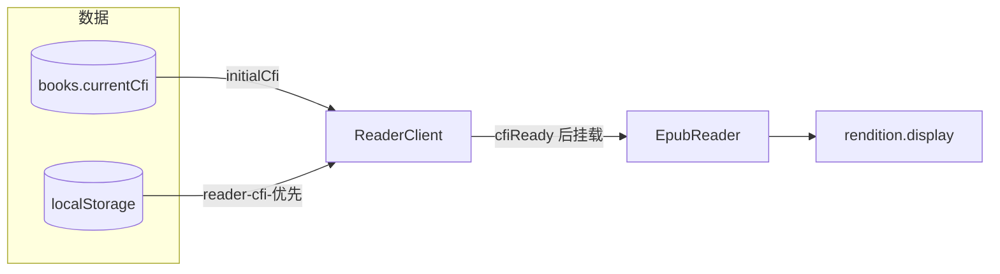
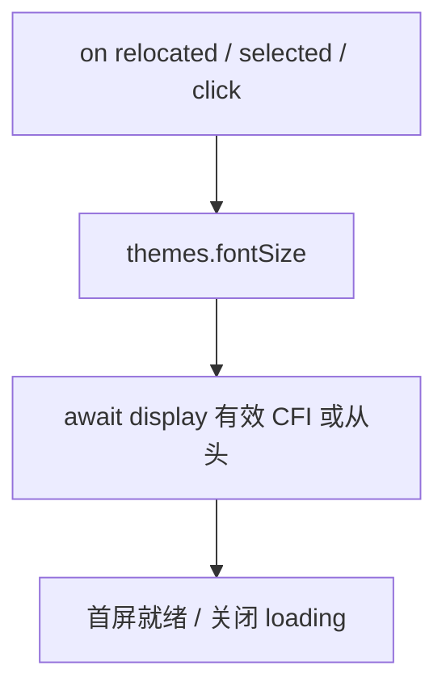
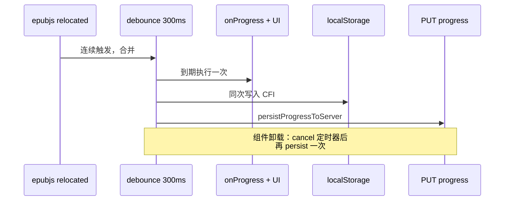

# EPUB 阅读器：回显与进度

说明 **CFI 回显**、**进度持久化**（`PUT /api/books/:id/progress`）与 `epub-reader.tsx` 的要点。上传 EPUB 到书库另走 Blob，与本文无关。

---

## epubjs 在本项目

- **Book**：`ePub(blobUrl)` 加载 EPUB。
- **Rendition**：`renderTo` 容器，`flow: "paginated"`、`spread: "auto"`；尺寸用容器 `getBoundingClientRect()` 的像素宽高。
- **CFI**：标准锚点串，用于 `rendition.display(cfi)` 与持久化；比「章号 + 滚动」更稳。

**全书进度 0–100** 不依赖 `locations.generate`，而用 spine：`(spineIndex + page/total) / spine.length × 100`。章内进度来自 `location.start.displayed` 的 `page` / `total`。章名由 `navigation.toc` 按当前节 `href` 匹配，否则「第 N 章」。

---

## 回显（数据库 → 屏幕）

1. **Server**：`page.tsx` 把 `books.currentCfi` 作为 `initialCfi` 传给 `ReaderClient`。
2. **Client**：`ReaderClient` 在 `useEffect` 里读 `localStorage` 的 `reader-cfi-${bookId}`，**优先于** `initialCfi`（减轻 Next 客户端路由缓存导致的服务端数据偏旧）。
3. **`cfiReady`**：读完 localStorage 并算出 `effectiveCfi` 后再为 `true`，此时才渲染 `EpubReader`，避免首帧用错 CFI。
4. **初始化顺序**：`rendition.on("relocated" / "selected" / "click")` → `themes.fontSize` → `await rendition.display(...)`，避免漏掉首次 `relocated`。

---

## 进度写入

`relocated` 回调经 **`debounce` 300ms**（`@/lib/debounce`）：合并高频翻页/重排触发的锚点更新。每次触发会：更新 `onProgress`、写 **localStorage**、调用 **`persistProgressToServer()`**（`PUT`，`readingProgress` 为四舍五入后的全书百分比）。

卸载时 **`debouncedRelocated.cancel()`** 后 **`persistProgressToServer()`** 一次，尽量带上 ref 里最新 CFI。**当前实现未**在 `visibilitychange`（切后台）单独 flush。

`selected`（划词）另 **`debounce` 200ms**，与进度无关。

---

## 其它实现细节

| 项 | 说明 |
|----|------|
| 按需加载阅读器 | `reader-client` 用 `next/dynamic` 加载 `EpubReader`（`ssr: false`），epubjs 随该分包加载 |
| `window.resize` | `rendition.resize` 对齐容器 |
| 键盘 | 左右键 `prev` / `next` |
| 容器 | `[overflow-anchor:none]` 减轻滚动锚定带来的跳动 |
| 首屏 | blob 解析 + `display` 完成前展示「加载书籍中…」 |

---

## 相关文件

| 文件 | 作用 |
|------|------|
| `read/[bookId]/page.tsx` | 取书、`initialCfi`、`blobUrl` |
| `read/[bookId]/reader-client.tsx` | CFI 优先级、`cfiReady`、工具栏与阅读时长等 |
| `components/reader/epub-reader.tsx` | epub 生命周期、防抖、进度 PUT |
| `lib/debounce.ts` | 通用 `debounce` + `cancel` |
| `api/books/[id]/progress/route.ts` | 进度读写 |

调试可用 `reader-debug` / `isReaderDebug()`（见 `reader-client` 等处的 `readerDebugLog`）。
