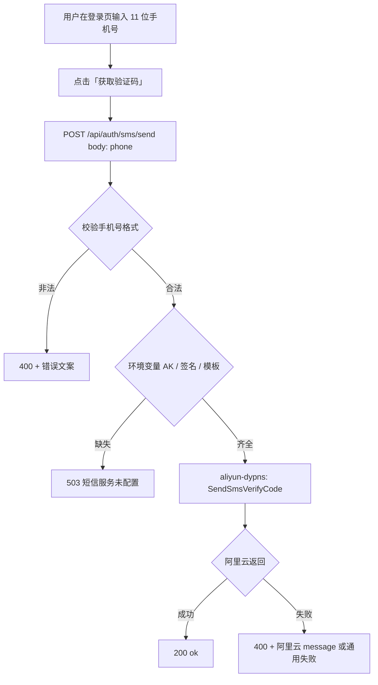
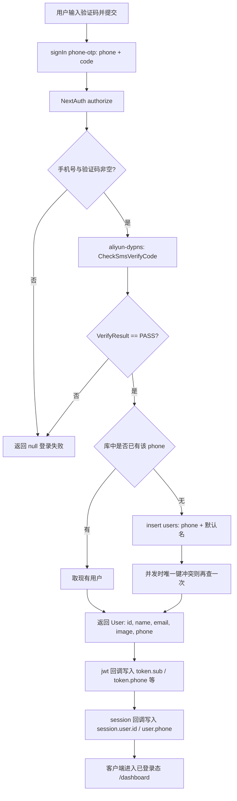
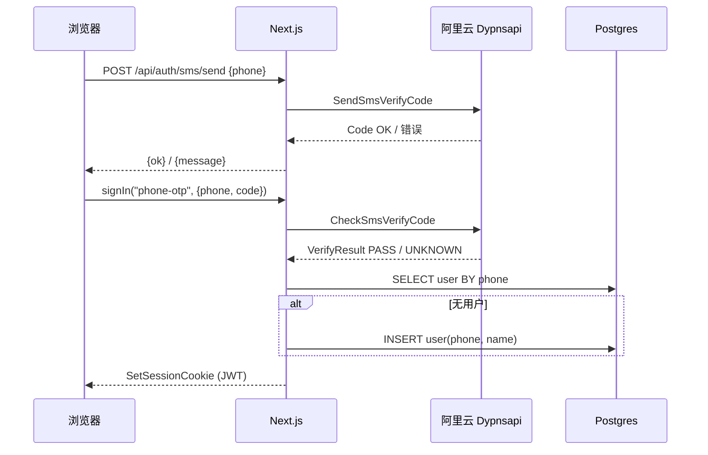

# 手机号短信验证码登录

本文说明本项目中 **手机号 + 短信验证码** 登录的实现方式、数据流与相关文件，便于维护与排错。

## 1. 设计目标

- 用户**无需事先注册**：验码成功后，若库中不存在该手机号则**自动创建** `users` 记录。
- 与现有 **NextAuth v5 + JWT 会话** 一致：与 GitHub / Google / 邮箱密码共用同一套 `session` 与受保护路由逻辑。
- 短信能力使用阿里云 **号码认证（Dypnsapi）** 的 `SendSmsVerifyCode` / `CheckSmsVerifyCode`，与「短信服务 Dysms 普通 SendSms」不是同一条产品线；权限与控制台配置需对应 **号码认证 / 赠送签名与模板**（详见 `docs/阿里云/`）。

## 2. 架构概览

| 层级 | 内容 |
|------|------|
| 前端 | `src/components/login-form.tsx`：手机号、获取验证码（60s 冷却）、验证码、`signIn("phone-otp", { phone, code })` |
| 发码 API | `POST /api/auth/sms/send` → `src/lib/aliyun-dypns.ts` 的 `sendSmsVerifyCode` |
| 登录 | NextAuth `Credentials` 提供方 `phone-otp`（`id: "phone-otp"`）→ `verifySmsCode` 通过后 `findOrCreateUserByPhone` |
| 会话 | `session.strategy: "jwt"`；`users.phone` 写入 JWT 的 `phone` 字段，再暴露到 `session.user.phone` |
| 数据 | `users` 表唯一字段 `phone`（11 位国内号），与 `email` 可并存或仅填其一 |

## 3. 流程图

### 3.1 获取验证码（发短信用）

### 3.2 验证码登录（验码 + 建号 + 发 JWT）

### 3.3 时序图（发码 + 登录）

## 4. 关键文件

| 文件 | 作用 |
|------|------|
| `src/lib/aliyun-dypns.ts` | Dypns 客户端单例、发码、验码；endpoint `dypnsapi.aliyuncs.com` |
| `src/lib/phone-auth.ts` | 国内 11 位号校验、脱敏展示用 `maskCnPhone` |
| `src/lib/auth.ts` | `findOrCreateUserByPhone`、`phone-otp` 的 `authorize`、JWT / session 中 `phone` |
| `src/app/api/auth/sms/send/route.ts` | 发码 HTTP 入口 |
| `src/lib/db/schema.ts` | `users.phone` 唯一、可空 |
| `src/lib/db/migrations/0006_user_phone.sql` | 列与唯一约束 |
| `src/types/next-auth.d.ts` | `User` / `Session` / `JWT` 的 `phone` 类型 |
| `src/components/login-form.tsx` | 手机号 UI、冷却、错误提示 |
| `.env.example` | 阿里云与模板相关变量说明 |

## 5. 环境变量（与 `.env.example` 一致）

- `ALIBABA_CLOUD_ACCESS_KEY_ID` / `ALIBABA_CLOUD_ACCESS_KEY_SECRET`：RAM 子账号，需含号码认证相关权限（如 `AliyunDypnsFullAccess` 或仅 `dypns:SendSmsVerifyCode`、`CheckSmsVerifyCode` 的自定义策略）。
- `ALIYUN_SMS_SIGN_NAME` / `ALIYUN_SMS_TEMPLATE_CODE`：号码认证控制台的**赠送签名**、**赠送模板 CODE**。
- 可选 `ALIYUN_SMS_TEMPLATE_PARAM`：与模板变量一致，默认常为 `{"code":"##code##","min":"5"}`。
- 可选 `ALIYUN_SMS_SCHEME_NAME`：发码与验码需与控制台「方案」一致时填写。

## 6. 安全与运维注意

- 验证码的权威校验在**阿里云**侧完成；自建库不存短信验证码原文。
- 发码接口对未登录用户开放，主要依赖**阿里云频控**与模板侧限制；若被刷流量，可再在网关或接口层加 IP/图形验证码等（当前未做）。
- `phone-otp` 与邮箱 / OAuth 用户可视为不同账号；**同一自然人不自动合并**手机与邮箱（未做账号绑定产品逻辑）。

## 7. 本地/预发联调建议

- 改 `.env.local` 后需**重启** dev 进程。
- 执行过迁移后确保存在 `users.phone` 列：`npm run db:migrate`。
- 用真实手机号走一遍：登录页 → 获取验证码 → 输入短信中的码 → 进入 `dashboard`；或 `curl` 调用 `POST /api/auth/sms/send` 仅测发码（会真实扣费/计条，请谨慎）。

---

*文档随实现版本编写；若接口或表结构变更，请同步更新本页与 `docs/阿里云` 下说明。*
