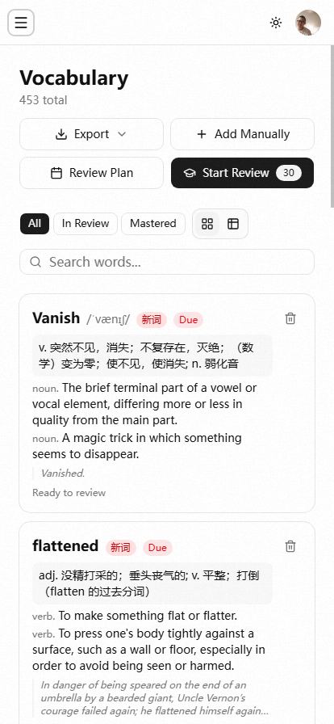
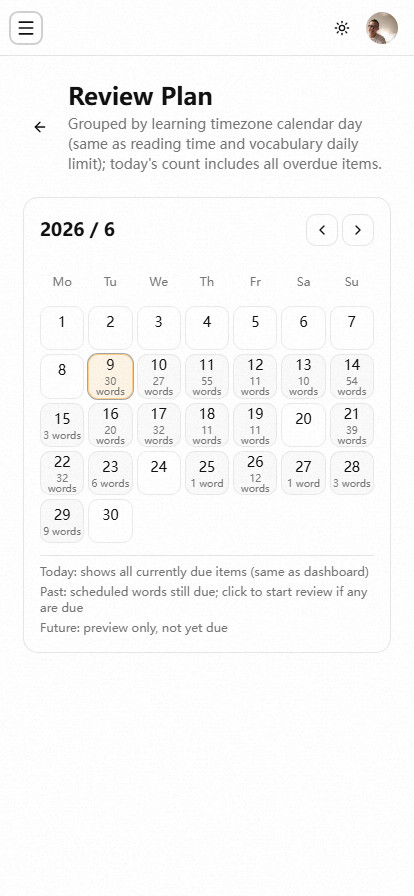
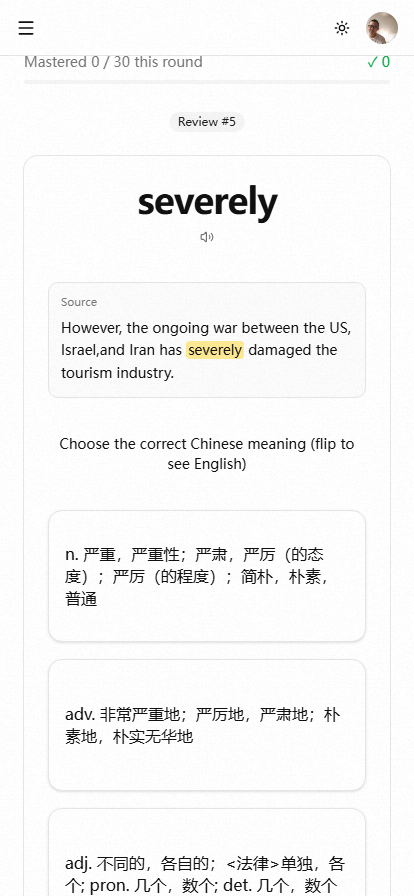
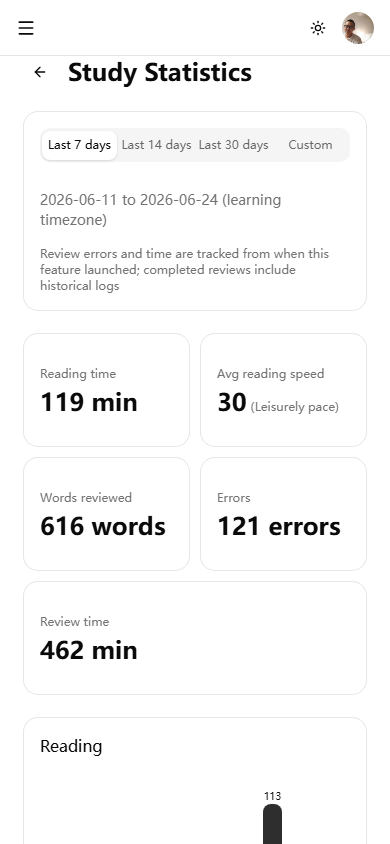
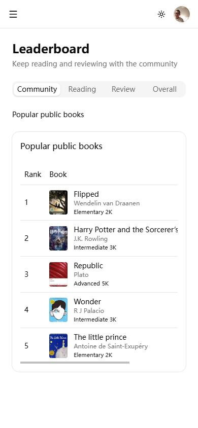

# 知乎推荐文章

> 发布建议：问题型回答可直接用「正文」；专栏文章可加「导语」。配图使用 `docs/screenshots/*-移动端.png`，上传至知乎图床后替换，或本地预览时看相对路径。
> 在线体验：https://english-read.bitbw.top/

---

## 适用问题示例

- 有哪些适合读英文原著、同时能记单词的工具/网站？
- 艾宾浩斯遗忘曲线背单词，有什么好用的 App 或网站？
- 读 EPUB 英文书，如何高效积累生词？

---

## 标题

**读英文书时查词、收录、复习能不能在一个工具里完成？我试了一个开源 Web 应用 English Read**

---

## 导语（专栏可选）

很多英语学习者会分开用「阅读器 + 词典 + 背单词 App」，生词要在几个软件之间来回倒，很难坚持。English Read 把 EPUB 在线阅读、生词本和艾宾浩斯间隔复习放在同一套流程里，下面简单说下体验和适合谁。

---

## 正文

### 它解决什么问题？

读英文原著时，遇到生词通常要：查词典 → 抄到笔记本或背词 App → 自己安排复习。阅读和记忆是断开的，往往书读不下去，单词也记不牢。

**English Read** 的思路是：**在阅读场景里完成「查词 → 收录 → 复习」闭环**。

🔗 在线体验：https://english-read.bitbw.top/

---

### 核心功能

#### 1. 在线 EPUB 阅读 + 公共书库

支持上传个人 EPUB，也可以从公共书库选书加入书架（如 *Harry Potter*、*The Little Prince* 等）。分页阅读，字号可调，阅读进度自动保存。

阅读中选中单词，弹出音标、英文释义和中文翻译，可一键加入生词本，无需切换应用。

---

#### 2. 生词本与复习计划

所有阅读中收藏的词进入生词本，可查看每个词的复习阶段和下次复习时间。

---

#### 3. 艾宾浩斯间隔重复（SRS）

复习间隔：**1 → 2 → 4 → 7 → 15 → 30 天**，到点进入复习队列。复习形式包括释义选择和拼写还原，「忘了」会重置阶段。

这和常见的 Anki / 各类背词 App 逻辑类似，但**词来自你真实读过的书**，语境更记得住。

---

#### 4. 学习统计

可按 7 / 14 / 30 天或自定义区间查看：阅读时长、平均阅读速度（wpm）、复习词数、错误次数、复习时长等，带柱状图和每日明细。

---

#### 5. 社区排行榜（可选参与）

有热门公共书榜单，以及阅读时长、复习时长、连续学习等综合排行。不想公开排名可在设置中关闭。

---

### 适合谁？

| 人群 | 是否推荐 |
|------|----------|
| 读英文 EPUB 原著、想系统积累生词 | ✅ 很适合 |
| 已经在用艾宾浩斯/间隔重复，希望词来自真实阅读 | ✅ 很适合 |
| 需要离线阅读或纯移动端 App | ⚠️ 这是 Web 站，需联网；手机浏览器可用 |
| 只想要纯背词、不读书 | ❌ 核心价值在阅读场景 |

---

### 小结

English Read 不是又一个孤立背单词 App，而是**把英文阅读和词汇复习绑在一起**的工具：读 → 查 → 存 → 按遗忘曲线复习 → 用数据看进度。对个人学习者来说，免费、开箱即用，值得一试。

**体验地址**：https://english-read.bitbw.top/  
**项目开源**：仓库内 README 有完整部署说明，开发者可自行搭建。

---

## 文末互动（可选）

你平时读英文书用什么查词、怎么记生词？欢迎评论区交流。
